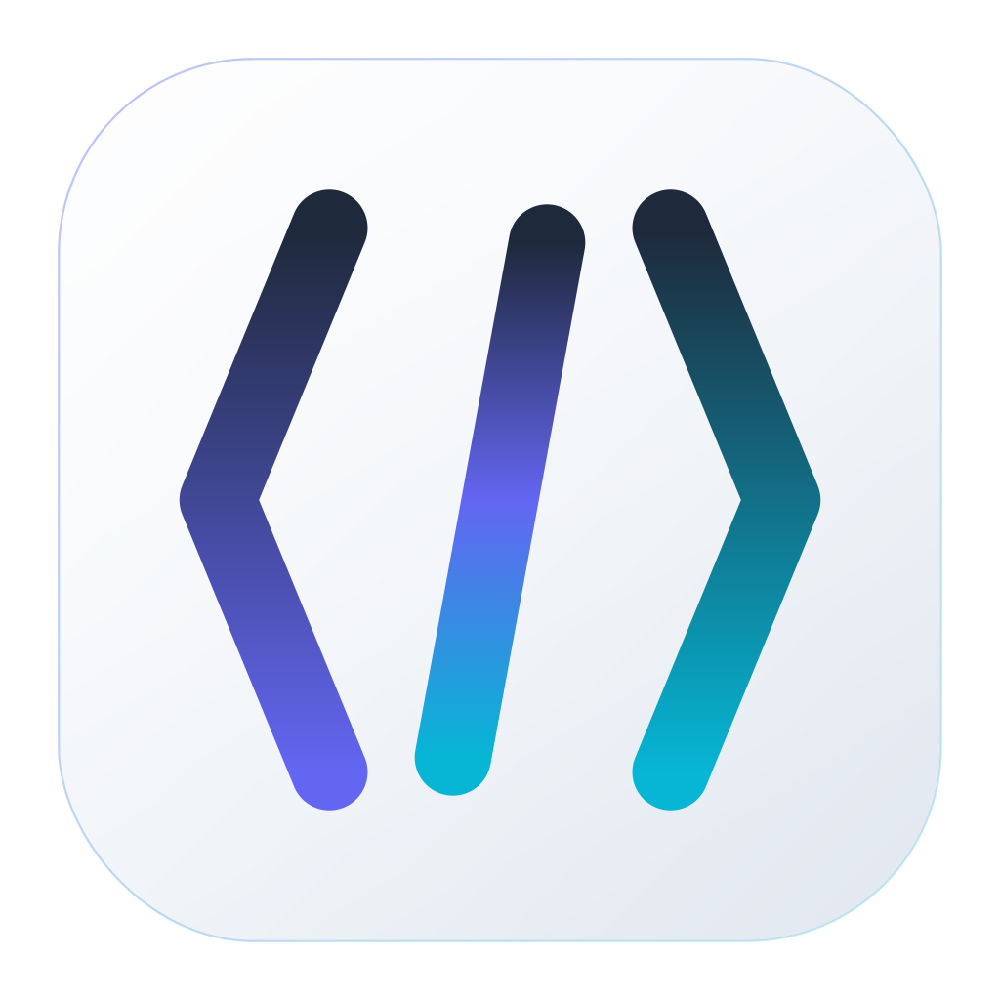

<p align="center">
  
</p>

<h1 align="center">Clauge</h1>

<p align="center">
  Run multiple Claude Code sessions in parallel — organized by project, each with its own purpose and terminal.
</p>

<p align="center">
  <a href="https://github.com/ansxuman/Clauge/blob/main/LICENSE"></a>
  <a href="https://github.com/ansxuman/Clauge/stargazers"></a>
  <a href="https://github.com/ansxuman/Clauge/issues"></a>
  <a href="https://github.com/ansxuman/Clauge/releases/latest"></a>
</p>

<p align="center">
  <a href="https://github.com/ansxuman/Clauge/issues">Report Bug</a> ·
  <a href="https://github.com/ansxuman/Clauge/issues">Request Feature</a> ·
  <a href="https://buymeacoffee.com/ansxuman">Buy me a coffee</a>
</p>

---

## Features

### Sessions with purpose
Create sessions for **Brainstorming**, **Development**, **Code Review**, or **Debugging**. Claude adapts its behavior to match — brainstorming sessions explore ideas without jumping to code, development sessions focus on clean implementation, code review catches bugs and edge cases, debugging traces root causes methodically.

### Parallel sessions, zero conflicts
Run multiple sessions on the same project at once. Each session is automatically isolated — edit files in one without breaking the other. Switch between them instantly, no re-spawning.

### ~10MB, minimal resource usage
Built with Rust and Tauri. No Electron, no bundled Chromium. Starts in under a second, uses a fraction of the memory. Translucent sidebar, system tray, dark/light themes.

### Everything in one window
Embedded interactive terminal with full color, scrollback, and resize. Sessions grouped by project with expand/collapse. Auto-discovers your existing Claude Code sessions. Usage limits visible in the menu bar.

### Keyboard-first
`Cmd+N` new session · `Cmd+1-9` switch sessions · `Cmd+B` toggle sidebar · `Escape` close modals

## Download

<a href="https://github.com/ansxuman/Clauge/releases/latest"><strong>Download for macOS →</strong></a>

## Development

**Requires:** [Bun](https://bun.sh), [Rust](https://rustup.rs) 1.77+, [Tauri CLI](https://tauri.app) v2

```bash
git clone https://github.com/ansxuman/Clauge.git
cd Clauge
bun install
bun run tauri dev
```

## Tech Stack

| | |
|---|---|
| **Frontend** | SvelteKit, Svelte 5 |
| **Backend** | Rust, Tauri v2 |
| **Terminal** | xterm.js, portable-pty |

## Contributing

See [CONTRIBUTING.md](.github/CONTRIBUTING.md).

## Support

<a href="https://www.buymeacoffee.com/ansxuman" target="_blank"></a>

## License

[Apache License 2.0](LICENSE)
